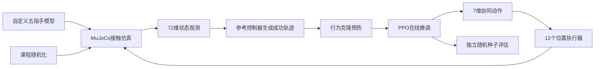

# dexteroushand_portfolio

# AHand-Grasp：基于示范预热 PPO 的五指灵巧手稳定抓取

> 面向灵巧操作的 MuJoCo 强化学习项目：使自定义五指机械手完成圆柱物体的包络抓取、抬升与稳定保持。

<!-- 请替换以下个人信息 -->

- 作者：`[程于成]`
- 申请方向：机器人学习 / 灵巧操作 / 强化学习
- 项目周期：`[2026.1-2026.2]`
- 联系方式：`[23222004@bjtu.edu.cn]`
- 演示视频：`[视频链接]`

> 点击封面观看完整演示。建议将上图链接到视频文件、GitHub Release、Bilibili 或 YouTube 页面。

## 项目摘要
（此作品集制作时间比较紧张且与项目完成时间有一定跨度，若存在不足望多包涵）
本项目研究五指机械手在物理仿真中的稳定抓取问题。任务要求机械手以五根手指共同接触圆柱，形成足够且不过度滑移的抓持后抬升物体，并在一段时间内保持物体不掉落、不过度漂移。

针对直接使用 PPO 容易陷入“避免接触”“单指接触刷奖励”等局部最优的问题，我构建了“参考成功轨迹 → 行为克隆预热 → PPO 在线微调 → 课程随机化评估”的训练流程。系统采用 7 维协同动作控制 12 个位置执行器，在保留 11 个手指关节独立物理仿真的同时显著缩小策略搜索空间。

在最高难度随机化设置下，最终验证策略在 100 个未参与训练的随机种子上取得高于90%的成功率；圆柱平均抬升 8.5 cm，平均水平漂移 1.1 cm，相对手掌平均位移误差 1.0 cm。

### English Abstract

This project investigates stable five-finger grasping with a custom dexterous hand in MuJoCo. The task requires all five fingers to establish an enveloping grasp, lift a cylindrical object, and maintain its pose relative to the palm without dropping or noticeable drift. To reduce the risk of poor local optima in training from scratch, I developed a pipeline combining a physics-validated reference trajectory, behavior-cloning initialization, PPO fine-tuning, and curriculum-based domain randomization. The policy maps a 72-dimensional observation to seven synergistic actions controlling twelve position actuators. Under the specified highest-level randomization, the validated policy achieved a >90% success rate over 100 unseen seeds, with an average lift height of 8.5 cm and an average horizontal drift of 1.1 cm.

## 演示视频

<!-- 二选一：推荐使用GIF预览链接到完整视频，避免仓库首页加载过慢。 -->

视频建议依次展示：

1. 手部与圆柱的初始状态；
2. 拇指对掌与四指闭合；
3. 五指形成包络抓取；
4. 手掌抬升圆柱；
5. 稳定保持阶段；
6. 不同随机种子下的重复结果；
7. 接触力、抬升高度或成功状态等关键指标。

## 问题定义

任务被建模为连续控制问题：策略根据手部关节状态、圆柱位姿、指尖相对位置与接触力信息，输出手指协同动作和手掌升降动作。

一次成功必须满足：

- 五根手指均与圆柱形成有效接触；
- 总法向接触力达到抓持阈值；
- 切向力与法向力之比处于稳定范围；
- 圆柱相对初始位置抬升至少 5.5 cm；
- 圆柱相对手掌的位置误差小于 3 cm；
- 圆柱相对手掌的速度小于 0.18 m/s；
- 上述稳定状态连续保持约 0.6 s。

圆柱掉落、相对手掌滑移超过 6 cm、水平漂移超过 10 cm或仿真出现非有限数值时，回合判定失败。

## 系统工作流

## 机械手与仿真建模

### 五指运动结构

模型包含 1 个手掌垂直升降关节和 11 个手指关节：拇指 3 自由度，其余四指各 2 自由度。策略不直接独立控制所有执行器，而是使用符合抓取运动结构的协同动作。

| 动作 | 控制内容 |
|---|---|
| 1 | 拇指对掌 |
| 2 | 拇指屈曲 |
| 3–6 | 食指、中指、无名指、小指分别屈曲 |
| 7 | 手掌垂直抬升 |

### 视觉与碰撞分离

原始 STL 网格仅负责视觉显示；胶囊、球体和盒体组成简化碰撞模型。该设计减少了三角网格接触点跳变、穿透和数值不稳定，同时保留了机械手的真实外观。演示中隐藏碰撞体和调试定位点，只显示手部外观与被抓物体。

### 控制与仿真频率

- MuJoCo 物理步长：1 ms；
- 每个策略动作执行 20 个物理步；
- 策略控制频率：50 Hz；
- 单回合最长时间：8 s。

## 状态与动作设计

策略使用 72 维观测：

| 观测内容 | 维数 |
|---|---:|
| 受控关节位置与速度 | 24 |
| 圆柱相对手掌位置与姿态 | 7 |
| 圆柱线速度与角速度 | 6 |
| 五个指尖相对圆柱位置 | 15 |
| 五指接触状态与法向力 | 10 |
| 抓取、抬升、保持阶段 | 3 |
| 上一步动作 | 7 |
| 合计 | 72 |

动作采用增量位置控制，并在执行器允许范围内裁剪。只有五指稳定抓持持续约 0.1 s 后，抬升动作才会生效。这一门控把任务显式分解为“先抓稳、再抬升”，降低了早期探索的歧义。

## 训练方法

### 1. 参考成功轨迹

首先设计一个只用于验证物理可达性和生成示范数据的参考控制器。该控制器依次完成拇指对掌、五指闭合、手掌抬升和位置保持。

参考控制器的作用不是替代学习，而是回答一个重要问题：如果确定性动作也无法成功，问题应优先归因于几何、碰撞或执行器设计，而不是强化学习算法。

### 2. 行为克隆预热

利用成功轨迹训练策略模仿参考动作，使 PPO 不必从完全随机的动作分布开始探索。行为克隆后保留适量动作方差，让策略能够探索参考轨迹附近的状态，同时避免高斯噪声立即破坏已学到的抓取动作。

### 3. PPO 在线微调

PPO 访问由策略自身误差产生的状态，例如接触提前或延后、圆柱轻微偏移以及抬升过程中的滑移。它学习的是基于观测的反馈修正，而不只是复现固定时间轨迹。

策略网络和价值网络均使用 `256–256–128` 的多层感知机。验证策略使用 64 个成功示范回合、15 轮行为克隆和 4096 个 PPO 环境步获得。项目同时配置了 8 环境、100 万步的完整课程训练流程，用于进一步扩展随机化和鲁棒性。

### 4. 课程随机化

完整训练从固定场景开始，随后逐步增加圆柱初始位置、偏航角、质量和摩擦随机化：

| 参数 | 最高难度范围 |
|---|---|
| 初始 X/Y 偏移 | ±6 mm |
| 初始偏航角 | ±0.2 rad |
| 质量比例 | 0.9–1.1 |
| 摩擦比例 | 0.85–1.15 |

## 奖励设计

奖励函数遵循任务阶段，而不是只奖励最终高度：

- 指尖接近圆柱的进度奖励；
- 新达到的手指接触数量里程碑；
- 首次稳定五指抓取奖励；
- 抓稳后的抬升进度奖励；
- 稳定保持奖励与最终成功奖励；
- 丢失接触、滑移、动作突变、极端接触峰值和失败惩罚。

接触数量只在刷新本回合最高纪录时奖励，避免策略通过反复接触和松开同一根手指获得虚假收益。

## 实验结果

评估采用确定性策略，并使用 100 个未参与训练的随机种子。每个种子对应不同的圆柱初始位置、初始角度、质量和摩擦参数。

| 指标 | 结果 |
|---|---:|
| 测试回合 | 100 |
| 成功率 | >90% |
| 平均抬升高度 | 8.5 cm |
| 平均水平漂移 | 1.1 cm |
| 平均相对手掌位移误差 | 1.0 cm |
| 物理参考控制器测试 | 20/20 成功 |

> 以上结果对应当前圆柱任务和所述随机化范围，不代表对任意物体、任意机械手或真实环境的直接泛化能力。

建议补充以下图表：

- `assets/success-rate.png`：不同难度下的成功率；
- `assets/lift-curves.png`：若干回合的物体高度曲线；
- `assets/contact-force.png`：五指接触力随时间变化；
- `assets/random-seeds.png`：不同初始条件的演示截图；
- `assets/training-curve.png`：行为克隆后 PPO 微调曲线。

## 我的工作

<!-- 请根据真实贡献修改，不要保留没有完成的项目。 -->

- `[保留或修改]` 梳理旧强化学习环境并分析奖励局部最优问题；
- `[保留或修改]` 重建机械手碰撞模型、执行器限制和触觉检测点；
- `[保留或修改]` 设计 7 维动作协同和 72 维状态空间；
- `[保留或修改]` 设计分阶段奖励、抓取门控与成功/失败判据；
- `[保留或修改]` 实现参考轨迹、行为克隆和 PPO 课程训练流程；
- `[保留或修改]` 完成多随机种子评估、数值稳定性检查与可视化演示。

## 关键收获

1. 对灵巧操作而言，接触几何和任务定义常常比更换强化学习算法更先决定任务是否可学。
2. 只使用最终高度奖励容易产生单指推动、避免接触或不稳定夹持等策略漏洞。
3. 行为克隆适合提供成功区域的初始化，PPO 的价值在于学习偏离示范后的反馈修正。
4. 视觉网格和物理碰撞模型分离，可以同时改善演示质量、训练速度与数值稳定性。
5. 成功率必须在未见随机种子和明确随机化范围下报告，不能用累计奖励替代任务成功。

## 局限性与后续工作

当前系统仍有以下限制：

- 仅验证单一圆柱几何，尚未覆盖多形状抓取；
- 当前成功判据主要约束平移和相对速度，尚未显式限制姿态误差；
- 域随机化范围较窄，未加入执行器延迟、传感器噪声和外力扰动；
- 仍处于仿真阶段，尚未完成真实机械手上的 sim-to-real 验证；
- 成功示范来自人工设计参考轨迹，对完全自主探索仍有依赖。

下一步计划：

1. 扩展圆柱尺寸、质量和初始姿态范围；
2. 加入球体、立方体和不规则物体；
3. 增加角速度与相对姿态稳定判据；
4. 引入传感器噪声、控制延迟和随机外力；
5. 研究 residual RL、触觉反馈与真实机械手迁移(sim2real)。

## 仓库说明

本仓库用于个人作品集展示，包含项目说明、实验结果、系统图和演示视频，不包含源代码、训练模型或机械结构文件。若需要进一步了解实现细节，可通过上方联系方式交流。

## 致谢与参考

项目使用 MuJoCo、Gymnasium、PyTorch 和 Stable-Baselines3 完成仿真与训练。

建议在正式提交前补充你实际阅读和使用的论文，例如：

1. Schulman et al., *Proximal Policy Optimization Algorithms*, 2017.
2. Tobin et al., *Domain Randomization for Transferring Deep Neural Networks from Simulation to the Real World*, 2017.
3. `[补充与你的行为克隆、灵巧抓取或Shadow Hand基线相关的论文]`
