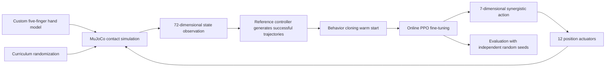

# AHand-Grasp: Stable Grasping with a Five-Finger Dexterous Hand using Demonstration-Warm-Started PPO

> A MuJoCo reinforcement learning project for dexterous manipulation: enabling a custom five-finger robotic hand to perform enveloping grasping, lifting, and stable holding of a cylindrical object.

> This portfolio was prepared within a limited timeframe and is based on a project completed some time ago. As a result, certain aspects may remain incomplete or subject to further refinement.

* Author: `[Yucheng Cheng]`
* Application Area: Robotic Learning / Dexterous Manipulation / Reinforcement Learning
* Project Period: `[Jan. 2026 – Feb. 2026]`
* Contact: `[23222004@bjtu.edu.cn]`

## Project Summary

This project investigates the problem of stable grasping with a five-finger robotic hand in physics simulation. The task requires the hand to establish effective multi-finger contact with a cylinder, form a sufficiently stable grasp without excessive slipping, lift the object, and keep it from falling or drifting significantly for a period of time.

To address common local optima in direct PPO training, such as “avoiding contact” or “exploiting rewards through single-finger contact,” I designed a training pipeline consisting of:

**reference successful trajectory → behavior cloning warm start → online PPO fine-tuning → curriculum-randomized evaluation**

The system uses a 7-dimensional synergistic action space to control 12 position actuators. This design preserves independent physical simulation of 11 finger joints while significantly reducing the policy search space.

Under the highest-level randomized setting, the final validation policy achieved a success rate above 90% over 100 unseen random seeds. The cylinder was lifted by an average of 8.5 cm, with an average horizontal drift of 1.1 cm and an average relative displacement error of 1.0 cm with respect to the palm.

## Problem Definition

The task is formulated as a continuous-control problem. Based on hand joint states, cylinder pose, fingertip-relative positions, and contact-force information, the policy outputs coordinated finger actions and palm-lifting actions.

A successful trial must satisfy the following conditions:

* All five fingers form effective contact with the cylinder.
* The total normal contact force reaches the grasping threshold.
* The ratio between tangential and normal forces remains within a stable range.
* The cylinder is lifted at least 5.5 cm from its initial position.
* The relative position error between the cylinder and the palm is below 3 cm.
* The relative velocity between the cylinder and the palm is below 0.18 m/s.
* The above stable state is maintained continuously for approximately 0.6 s.

An episode is marked as failed if the cylinder falls, slips more than 6 cm relative to the palm, drifts horizontally more than 10 cm, or if non-finite numerical values appear during simulation.

## System Workflow

## Robotic Hand and Simulation Modeling

### Five-Finger Kinematic Structure

The model consists of one vertical palm-lifting joint and 11 finger joints: 3 degrees of freedom for the thumb and 2 degrees of freedom for each of the other four fingers. Instead of independently controlling all actuators, the policy uses synergistic actions that match the structure of grasping motion.

| Action | Control Target                                         |
| ------ | ------------------------------------------------------ |
| 1      | Thumb opposition                                       |
| 2      | Thumb flexion                                          |
| 3–6    | Flexion of the index, middle, ring, and little fingers |
| 7      | Vertical palm lifting                                  |

### Separation of Visual and Collision Models

The original STL meshes are used only for visual rendering, while simplified collision geometries composed of capsules, spheres, and boxes are used for physics simulation. This design reduces contact-point discontinuities, penetration, and numerical instability caused by triangular mesh collisions, while preserving the realistic appearance of the robotic hand. In demonstrations, collision bodies and debugging markers are hidden, and only the hand appearance and the grasped object are displayed.

### Control and Simulation Frequency

* MuJoCo physics timestep: 1 ms
* Each policy action is executed for 20 physics steps
* Policy control frequency: 50 Hz
* Maximum episode duration: 8 s

## State and Action Design

The policy uses a 72-dimensional observation vector:

| Observation Component                                   | Dimension |
| ------------------------------------------------------- | --------: |
| Controlled joint positions and velocities               |        24 |
| Cylinder position and orientation relative to the palm  |         7 |
| Cylinder linear and angular velocities                  |         6 |
| Relative positions from five fingertips to the cylinder |        15 |
| Five-finger contact states and normal forces            |        10 |
| Grasping, lifting, and holding phase indicators         |         3 |
| Previous action                                         |         7 |
| Total                                                   |        72 |

The action is implemented as incremental position control and is clipped within the allowable actuator ranges. The lifting action is enabled only after the five-finger grasp has remained stable for approximately 0.1 s. This gating mechanism explicitly decomposes the task into “grasp first, then lift,” reducing ambiguity during early-stage exploration.

## Training Method

### 1. Reference Successful Trajectory

A reference controller was first designed to verify physical feasibility and generate demonstration data. The controller sequentially performs thumb opposition, five-finger closure, palm lifting, and position holding.

The purpose of the reference controller is not to replace learning, but to answer an important diagnostic question: if even deterministic actions cannot complete the task, the issue should first be attributed to geometry, collision modeling, or actuator design rather than the reinforcement learning algorithm.

The reference controller also helps avoid convergence difficulties and local optima that often occur when training directly with PPO from scratch.

### 2. Behavior Cloning Warm Start

Successful trajectories are used to train the policy to imitate reference actions, so PPO does not have to start exploration from a completely random action distribution. After behavior cloning, an appropriate amount of action variance is retained, allowing the policy to explore states near the reference trajectory while preventing Gaussian noise from immediately destroying the learned grasping behavior.

### 3. Online PPO Fine-Tuning

PPO explores states caused by the policy’s own errors, such as early or delayed contact, slight cylinder displacement, and slipping during the lifting phase. The policy learns observation-based feedback correction rather than simply reproducing a fixed-time trajectory.

Both the policy network and the value network use a multilayer perceptron with hidden layers of `256–256–128`. The validation policy was obtained using 64 successful demonstration episodes, 15 behavior cloning epochs, and 4,096 PPO environment steps. The project also includes a full curriculum training setup with 8 parallel environments and 1 million environment steps for further scaling of randomization and robustness.

### 4. Curriculum Randomization

The full training process starts from a fixed scenario and gradually increases randomization in cylinder initial position, yaw angle, mass, and friction:

| Parameter          | Highest-Difficulty Range |
| ------------------ | ------------------------ |
| Initial X/Y offset | ±6 mm                    |
| Initial yaw angle  | ±0.2 rad                 |
| Mass scaling       | 0.9–1.1                  |
| Friction scaling   | 0.85–1.15                |

## Reward Design

The reward function follows task stages instead of rewarding only final object height:

* Progress reward for fingertips approaching the cylinder
* Milestone reward for newly achieved numbers of finger contacts
* First stable five-finger grasp reward
* Lifting progress reward after a stable grasp is achieved
* Stable holding reward and final success reward
* Penalties for contact loss, slipping, abrupt actions, extreme contact-force peaks, and failure

The number of contacts is rewarded only when it refreshes the highest contact count within the current episode. This prevents the policy from gaining artificial rewards by repeatedly touching and releasing the same finger.

## Experimental Results

Evaluation is conducted with a deterministic policy over 100 random seeds that were not used during training. Each seed corresponds to different cylinder initial positions, initial angles, mass values, and friction parameters.

| Metric                                          |           Result |
| ----------------------------------------------- | ---------------: |
| Test episodes                                   |              100 |
| Success rate                                    |             >90% |
| Average lifting height                          |           8.5 cm |
| Average horizontal drift                        |           1.1 cm |
| Average relative displacement error w.r.t. palm |           1.0 cm |
| Physical reference-controller test              | 20/20 successful |

> The above results correspond to the current cylinder task and the specified randomization range. They do not imply direct generalization to arbitrary objects, arbitrary robotic hands, or real-world deployment.

Suggested figures to include:

* `contact_forces.png`: contact-force curves of the five fingers over time
* `motion_metrics.png`: object height curve
* `front.png`: demonstration screenshots under different initial conditions, front view
* `left.png`: demonstration screenshots under different initial conditions, side view
* `above.png`: demonstration screenshots under different initial conditions, top view

## My Contributions

* Reviewed the previous reinforcement learning environment and analyzed local optima in reward design.
* Rebuilt the robotic hand collision model, actuator limits, and tactile detection points.
* Designed the 7-dimensional action synergy and 72-dimensional state space.
* Designed staged rewards, grasping gates, and success/failure criteria.
* Implemented the reference trajectory, behavior cloning, and PPO curriculum training pipeline.
* Completed multi-seed evaluation, numerical stability checks, and visual demonstrations.

## Key Takeaways

1. For dexterous manipulation, contact geometry and task definition often determine learnability before changing the reinforcement learning algorithm becomes meaningful.
2. Using only a final-height reward without behavior cloning can lead to policy loopholes such as single-finger pushing, non-enveloping grasps, or unstable holding, making convergence difficult due to local optima.
3. Behavior cloning is useful for initializing the policy near successful regions, while PPO is valuable for learning feedback corrections after deviations from demonstrations.
4. Separating visual meshes from physical collision models can improve demonstration quality, training speed, and numerical stability at the same time.
5. Success rate should be reported under unseen random seeds and explicit randomization ranges. Cumulative reward should not be used as a substitute for task success.

## Limitations and Future Work

The current system still has several limitations:

* It has only been validated on a single cylindrical geometry and has not yet covered multi-shape grasping.
* The current success criteria mainly constrain translation and relative velocity, while orientation error is not yet explicitly constrained.
* The domain randomization range is still narrow, and actuator delay, sensor noise, and external disturbances have not yet been included.
* The system is still simulation-based and has not yet been validated through sim-to-real transfer on a physical robotic hand.
* Successful demonstrations are generated from a manually designed reference trajectory, so the system still depends on prior engineering design and cannot guarantee a 100% success probability.

`fail.png`

Future work includes:

1. Expanding the ranges of cylinder size, mass, and initial pose
2. Adding spheres, cubes, and irregular objects
3. Introducing angular-velocity and relative-orientation stability criteria
4. Incorporating sensor noise, control delay, and random external forces
5. Studying residual RL, tactile feedback, and sim-to-real transfer to a physical robotic hand

## Repository Notes

This repository is intended for personal portfolio demonstration. It includes the project description, experimental results, system diagram, and demonstration videos, but does not include source code, trained models, or mechanical structure files. For further implementation details, please contact me through the email address above.

## Acknowledgements and References

This project was implemented using MuJoCo, Gymnasium, PyTorch, and Stable-Baselines3.

## References

This portfolio is inspired by recent works on reinforcement learning, imitation learning, and contact-rich dexterous manipulation for robotic hands.

[1] Y. Chen, T. Wu, S. Wang, X. Feng, J. Jiang, Z. Lu, S. McAleer, H. Dong, S.-C. Zhu, and Y. Yang, “Towards Human-Level Bimanual Dexterous Manipulation with Reinforcement Learning,” *Advances in Neural Information Processing Systems (NeurIPS), Datasets and Benchmarks Track*, 2022. [[Paper]](https://proceedings.neurips.cc/paper_files/paper/2022/hash/217a2a387f52c30755c37b0a73430291-Abstract-Datasets_and_Benchmarks.html) [[Project]](https://pku-marl.github.io/DexterousHands/) [[Code]](https://github.com/PKU-MARL/DexterousHands)

[2] Z. Chen, S. Chen, E. Arlaud, I. Laptev, and C. Schmid, “ViViDex: Learning Vision-Based Dexterous Manipulation from Human Videos,” *IEEE International Conference on Robotics and Automation (ICRA)*, 2025. [[Paper]](https://arxiv.org/abs/2404.15709)

[3] Y. Qin, Y.-H. Wu, S. Liu, H. Jiang, R. Yang, Y. Fu, and X. Wang, “DexMV: Imitation Learning for Dexterous Manipulation from Human Videos,” *European Conference on Computer Vision (ECCV)*, 2022. [[Project]](https://yzqin.github.io/dexmv/) [[Paper]](https://arxiv.org/abs/2108.05877)

[4] Z. Jiang, Y. Xie, K. Lin, Z. Xu, W. Wan, A. Mandlekar, L. Fan, and Y. Zhu, “DexMimicGen: Automated Data Generation for Bimanual Dexterous Manipulation via Imitation Learning,” *IEEE International Conference on Robotics and Automation (ICRA)*, 2025. [[Project]](https://dexmimicgen.github.io/) [[Paper]](https://arxiv.org/abs/2410.24185)

[5] S. Wistreich, B. Shi, S. Tian, S. Clarke, M. Nath, C. Xu, Z. Bao, and J. Wu, “DexSkin: High-Coverage Conformable Robotic Skin for Learning Contact-Rich Manipulation,” *Conference on Robot Learning (CoRL)*, 2025. [[Project]](https://dex-skin.github.io/) [[Paper]](https://arxiv.org/abs/2509.18830)
